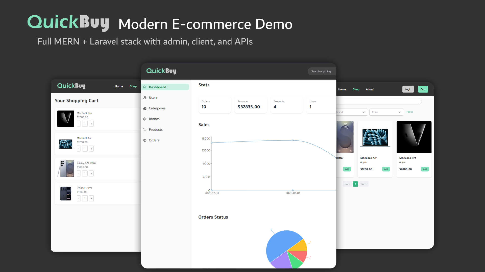
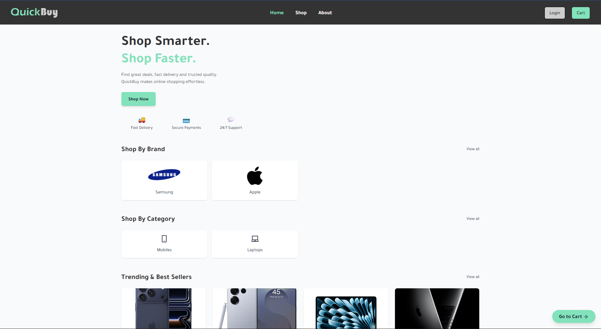
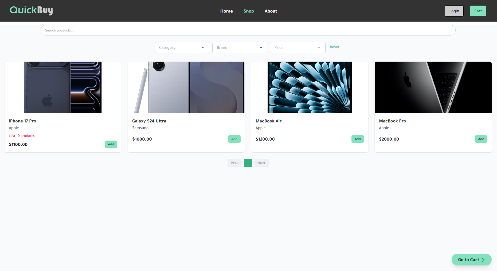
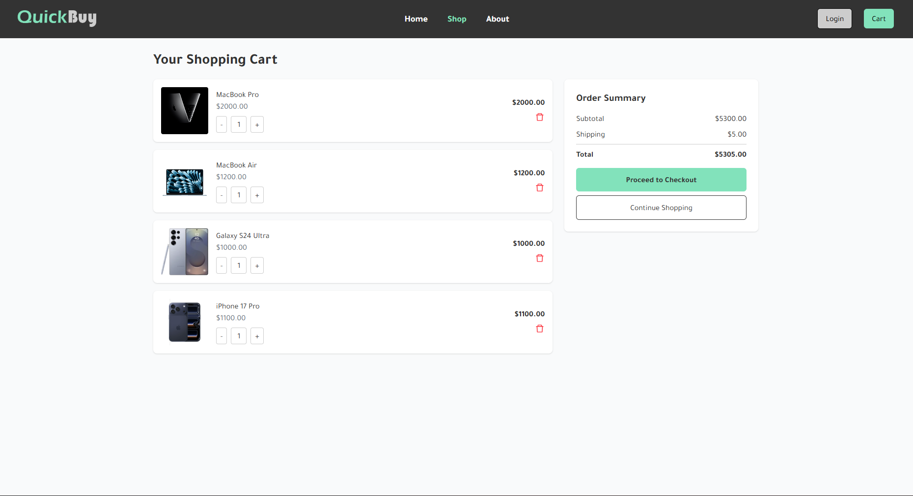
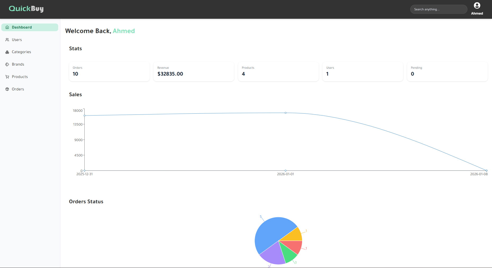
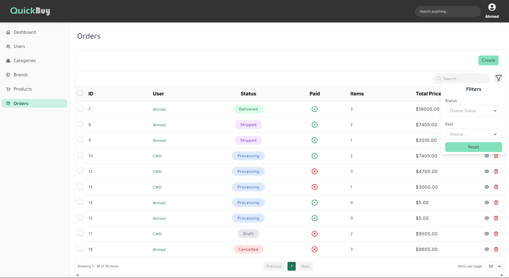
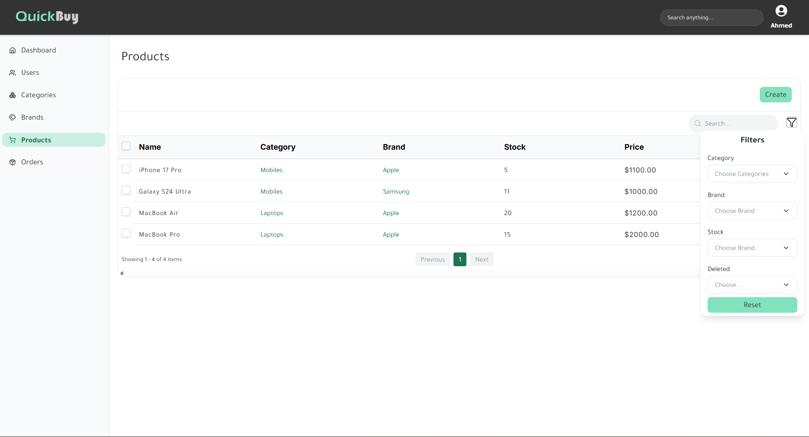
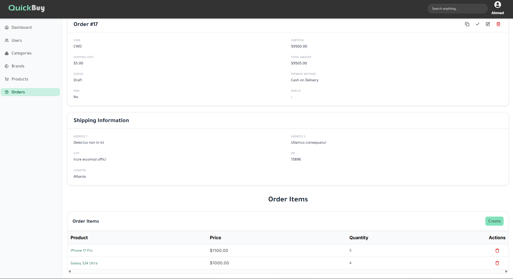

# QuickBuy - E-Commerce Platform 🛒



QuickBuy is a modern e-commerce platform with separate client and admin apps, providing a seamless shopping experience for customers and a powerful management dashboard for admins. The project uses both Express.js and Laravel backends.

---

## Table of Contents

* Features
* Screenshots
* Tech Stack
* Installation
* Folder Structure
* Contributing
* License

---

## Features

### Customer (Client) App:

* Browse products and categories
* Add items to cart and checkout
* View order history and details
* Responsive design for mobile and desktop

### Admin App:

* Dashboard overview of orders, products, and analytics
* Manage products, categories, and stock
* View and update orders
* Tables for orders and products with filtering

---

## Screenshots

### Home Page



### Shop Page



### Cart Page



### Admin Dashboard



### Orders Table



### Products Table



### Show Order Details



---

## Tech Stack

* Frontend: React (Vite + Tailwind CSS) for client & admin
* Backend: Node.js + Express, PHP + Laravel
* Database: MongoDB (Express), MySQL/PostgreSQL (Laravel)
* Authentication: JWT for Express, auth-sanctum for Laravel
* File Storage: Local

---

## Installation

1. Clone the repository:

```bash
git clone https://github.com/Ahmed-Al-Hemyari/ecommerce-project.git
cd quickbuy
```

2. Install dependencies:

* Client App:

```bash
cd client
npm install
```

* Admin App:

```bash
cd ../admin
npm install
```

* Express Backend:

```bash
cd ../express
npm install
```

* Laravel Backend:

```bash
cd ../laravel
composer install
cp .env.example .env
php artisan key:generate
```

3. Set environment variables:

* Express (`express/.env`):

```
PORT=8000
MONGO_URI=mongodb://127.0.0.1:27017/quickbuy_db
JWT_SECRET=your_jwt_secret
```

* Laravel (`laravel/.env`):

```
DB_CONNECTION=mysql
DB_HOST=127.0.0.1
DB_PORT=3306
DB_DATABASE=quickbuy
DB_USERNAME=root
DB_PASSWORD=
```

4. Run the applications:

```bash
# Express backend
cd express
npm run dev

# Laravel backend
cd ../laravel
php artisan serve

# Client app
cd ../client
npm run dev

# Admin app
cd ../admin
npm run dev
```

---

## Folder Structure

```
quickbuy/
├─ admin/             # Admin frontend (React + Tailwind)
├─ client/            # Client frontend (React + Tailwind)
├─ express/           # Node.js + Express + MongoDB backend
├─ laravel/           # Laravel backend
├─ screenshots/            # Screenshots and assets for README
└─ README.md
```

---

## License

This project is licensed under the MIT License.

---

Contact:

Author: Ahmed Al-Hemyari (https://github.com/Ahmed-Al-Hemyari)

Email: ahmed.a.alhemyari@gmail.com

---

**QuickBuy** – Fast, scalable, and user-friendly e-commerce solution. 🚀
